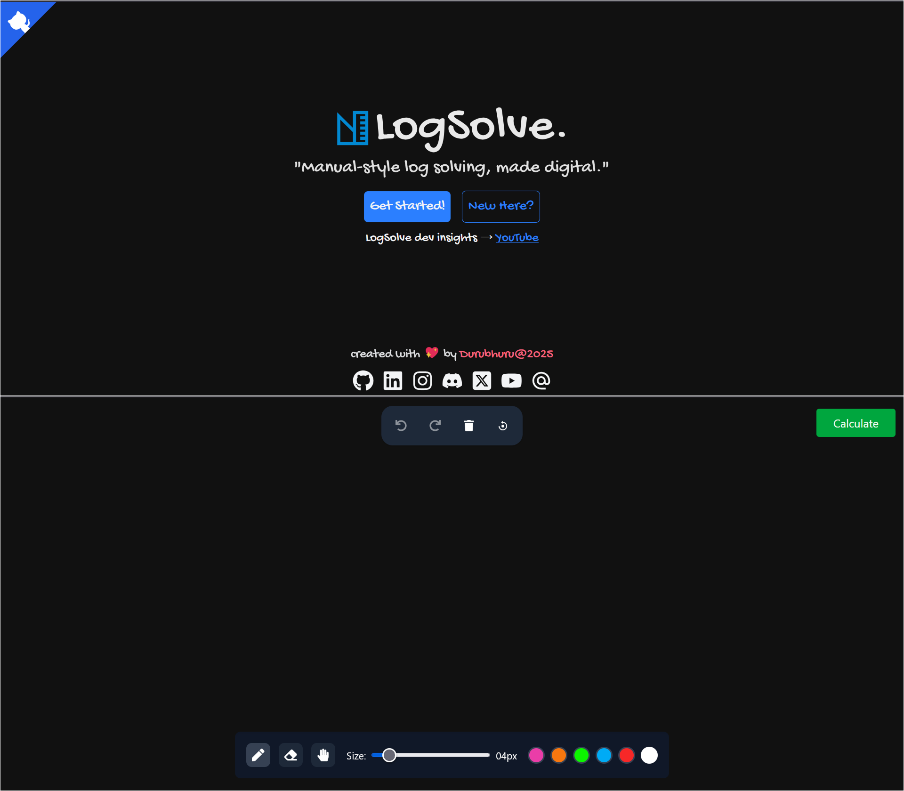

# LogSolve - Human-Style Log Solving, Automated

<p align="center">
  
</p>

> ⚠️ **Note:** This is the **frontend** repo of LogSolve.
> For the full monorepo (frontend + backend), visit:
> 👉 [https://github.com/Durubhuru14/LogSolve](https://github.com/Durubhuru14/LogSolve)

---

## 🖼️ Screenshots



---

## 🧰 Tech Stack

This frontend is built using modern React tooling and canvas drawing capabilities.

### ⚛️ Frameworks & Libraries

- **React 19** – UI library
- **React DOM**
- **React Router DOM (v7)** – Routing
- **React Konva** – Canvas & freehand drawing
- **Axios** – HTTP client
- **React Icons** – Icon set

### 🎨 Styling

- **Tailwind CSS** – Utility-first styling
- **@tailwindcss/vite** – Tailwind integration with Vite

### ⚙️ Tooling

- **Vite** – Fast build/dev tool
- **ESLint** – Linting
- **@vitejs/plugin-react** – React + Vite integration
- **TypeScript types for React**

---

## 📜 Scripts

```bash
npm run dev       # Start development server
npm run build     # Build for production
npm run preview   # Preview production build
npm run lint      # Run ESLint
```